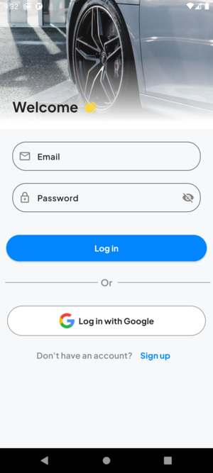

# Ride Mobile App

<div align="center">



</div>

<p align="center">
  
  
  
</p>

## 📋 <a name="table">Table of Contents</a>

1. 👋 [Welcome](#welcome)
2. ⚙️ [Tech Stack](#tech-stack)
3. 🔋 [Features](#features)
4. ☹️ [Doesn't Have](#doesnt-have)
5. 🤸 [Quick Start](#quick-start)
6. 🚀 [More](#more)

## <a name="welcome"> 👋 Welcome </a>

Thanks for checking out this flutter mobile app. This was originally suppose to be built with [React Native](https://reactnative.dev/) from one of JavaScript Mastery Youtube channel [JavaScript Mastery](https://www.youtube.com/watch?v=kmy_YNhl0mw&t=13465s) (Shout out to Adrian 😃 ), but I decided to build the mobile app using [Flutter](https://flutter.dev/). Please check it out 😮 and let me know what you think.

## <a name="tech-stack">⚙️ Tech Stack </a>

- Flutter 3.4.0
- Dart 3.4.0
- Get 4.6.6

## <a name="features">🔋 Features</a>

👉 **On Boarding Screen**: visually appealing on boarding screen

👉 **Login and Sign Screen**: sign up and login screen

👉 **Input Validation**: Comprehensive email and password validation

👉 **Gesture Controlled Map**: has google like map called flutter map

👉 **Destination ,Rider Selection and Rider detail screen**: has an interchanining related ride selection screens

## <a name="doesnt-have"> ☹️ Doesn't Have </a>

❗❗ **_No Backend What-so-ever_**

❗❗ **_No Authentication_**

❗❗ **_No Real Time Location_**

## <a name="quick-start"> 🤸 Quick Start </a>

Follow this steps to setup the project locally on your machine.

**Prerequsites**

Make sure you have the following installed on your machine

- [Git](https://git-scm.com/)
- [Dart](https://dart.dev/get-dart)
- [Flutter](https://docs.flutter.dev/get-started/)

**Cloning the Repository**

```bash
git clone https://github.com/Miki0035/flutter_ride_clone.git

cd flutter_ride_clone
```

**Check everything**

Check if everything is setup to run a flutter application:

```bash
flutter doctor
```

**Installation**

Install the project dependencies using flutter:

```bash
 flutter pub get
```

**Running the Project**

Install an android emulator or use your android device in debug mode

```bash
flutter run
```

## <a name="more"> 🚀 More </a>

- For email login and sign up uses real email address
- For Password use strong password that contain more than 6 characters , at least one uppercase , at least one number and one special characters
